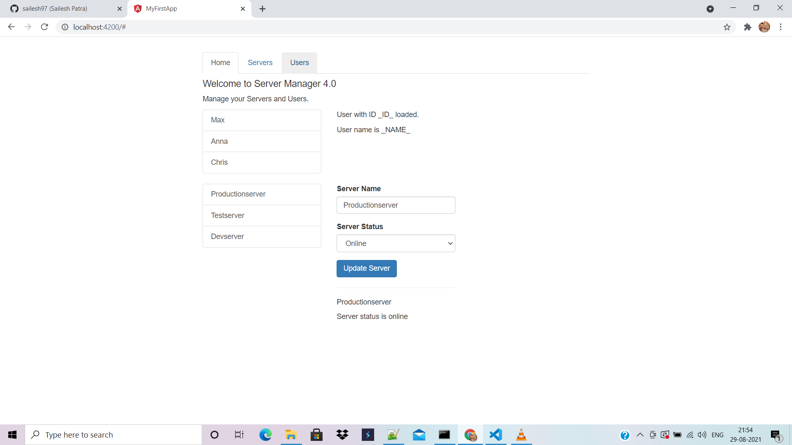
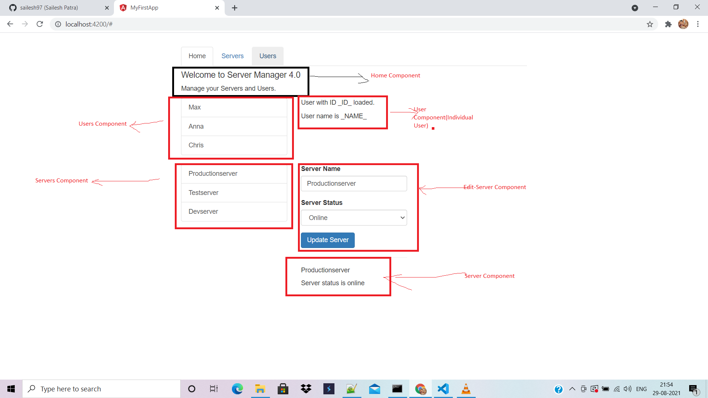

### As you can see in the image, initially there are 3tabs, but we are showing the content of all 3tabs in the same page which we will refactor in this project. So when you will click a tab, only content related to that tab will show in view. That's our goal.

### As shown in picture above, there are 3 main components:
1. Home Component
2. Servers Component
    1. Edit-Server Component
    2. Server (Single) Component
3. Users Component
    1. User component

## How to refactor:

